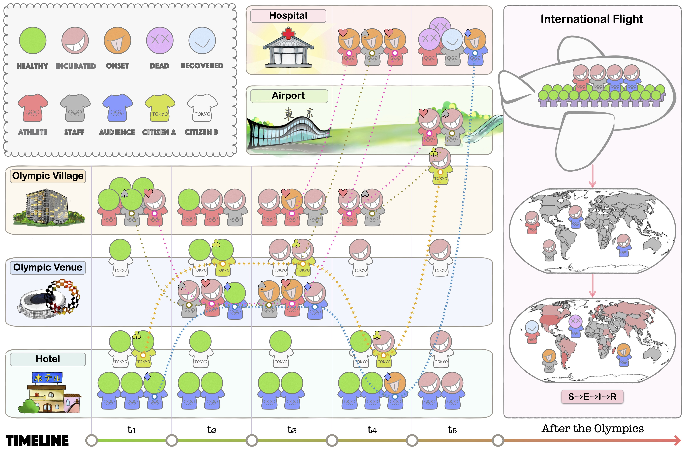

# Tokyo2021
Agent-based simulation of the pandemic during and after the Tokyo Olympic Games in 2021.

## Unreal Engine Project

### Requirements

* Unreal Engine 4.26.x
  
## Dynamic Policies Training
### Requirements

* Python 3.7
## Pandemic Transmission Aftermath
### Requirements

* MATLAB

